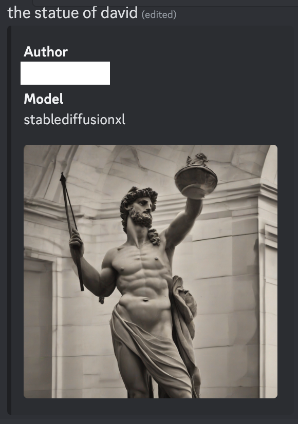
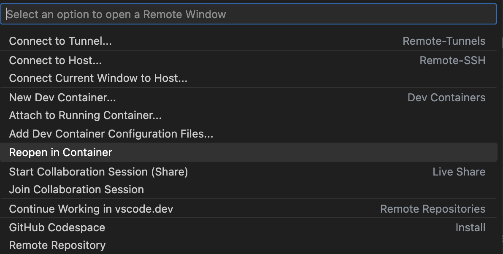

# Diffusion Bot

A Discord bot for interacting with diffusion models like [Stable Diffusion XL 1.0]:




## Getting started

### Local

Prerequisites:
- [git](https://git-scm.com/)
- [Python](https://docs.python.org/3/)
- [Poetry](https://python-poetry.org/docs/)
- [Node](https://nodejs.org/en)


1. Clone the repo

    ```zsh
    git clone git@github.com:hkiang01/diffusion-bot.git
    ```

1. Install dependencies
   
   API dependencies

    ```zsh
    cd api
    poetry config virtualenvs.in-project=true
    poetry install
    ```
    
    Note: If the GPU version of torch isn't compatible with your machine, change the dependency as follows:

    ```toml
    # pyproject.toml
    torch = { version = "^2.0.1" } # cpu
    # torch = { version = "^2.0.1", source = "cu118" } # gpu
    ```

    bot dependencies

    ```zsh
    cd ../bot
    npm install
    ```

1. Configure the Discord bot. Follow the instructions for [Creating your bot](https://discordjs.guide/preparations/setting-up-a-bot-application.html#creating-your-bot) in the [Discord developer portal](https://discord.com/developers/applications) and obtain:

   - the application's client id
   - the bot's token

    Then copy them in a file `.env`, created as a copy of `.env.sample`

    ```zsh
    cp .env.sample .env
    ```

    ```env
    # bot/.env
    API_URL=http://localhost:8000
    DISCORD_BOT_TOKEN=put_token_here
    DISCORD_OAUTH2_CLIENT_ID=put_client_id_here
    ```

1. Start the API

    ```zsh
    cd ../api
    poetry run uvicorn api.main:app --port 8000
    ```

1. Start the bot

    ```zsh
    cd ../bot
    npm run-script build
    npm run-script start
    ```

1. Follow the instructions for [Adding your bot to servers](https://discordjs.guide/preparations/adding-your-bot-to-servers.html)

1. Have fun!

### Dev Container

Prerequisites:
- [Docker](https://www.docker.com/)
- [Visual Studio Code](https://code.visualstudio.com/)


1. Install the [Dev Containers](https://marketplace.visualstudio.com/items?itemName=ms-vscode-remote.remote-containers) extension

1. Start the dev container by clicking "Open a Remote Window", then selecting "Reopen in Container"

    

    Note: If you don't have a GPU, comment out the following lines in `.devcontainer/devcontainer.json`:

    ```
    // "runArgs": [
    //     "--gpus",
    //     "all"
    // ],
    ```


### Adding more models

The whole code base is extensible. If you implement another subclass of `Model`:
- the API automatically adds it as another model able to be used in the dropdown of `/docs`
- the tests in `./api/tests/models/model_test.py` are automacially parameterized such that you can run `predict()` in the debugger without any additional code

[Stable Diffusion XL 1.0]: https://huggingface.co/stabilityai/stable-diffusion-xl-base-1.0/blob/ffd13a1d2ed00b2bbcf5d78c2a347313a3b556c8/README.md#sd-xl-10-base-model-card
[Install the NVIDIA Container Toolkit]: https://github.com/devcontainers/features/tree/f90cb26c7f15659f3e2be8061295997df2bb76cc/src/nvidia-cuda#install-the-nvidia-container-toolkit
[CUDA on Windows Subsystem for Linux (WSL)]: https://docs.nvidia.com/cuda/wsl-user-guide/index.html
