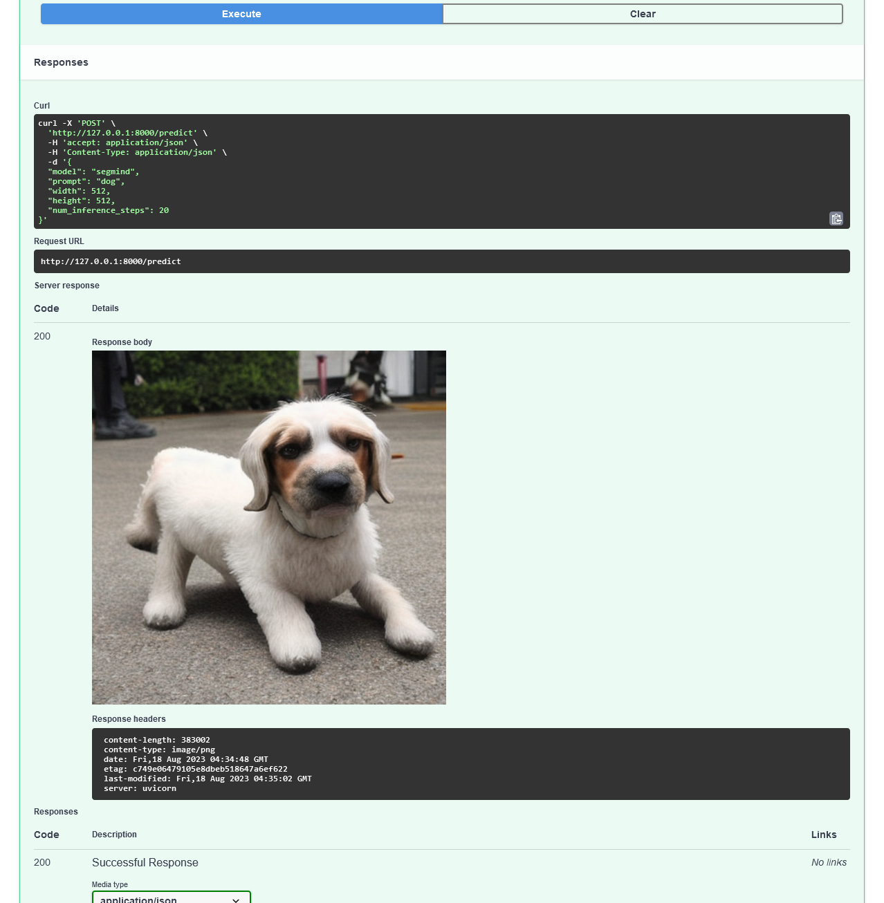
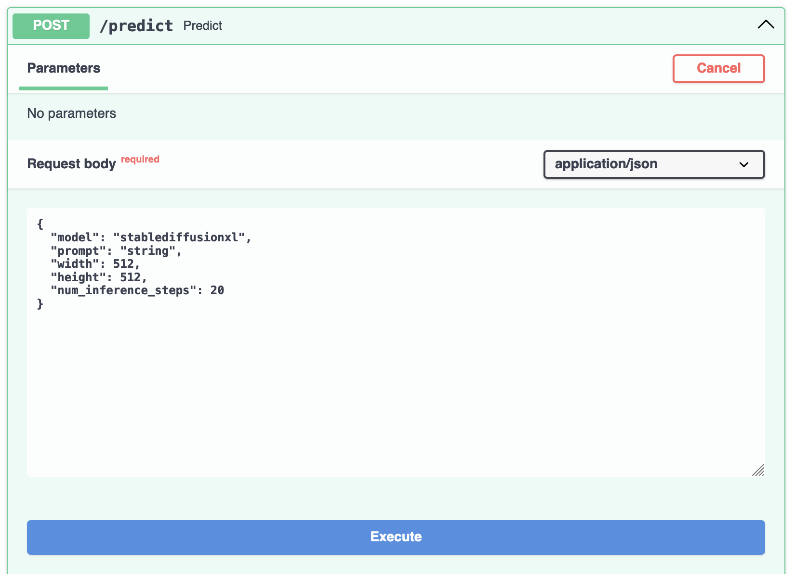

# Text to Image Server

An API to change text into images using models like [Stable Diffusion XL 1.0]:



## Getting started

1. Install [Docker](https://docs.docker.com/get-docker/)

1. Install dependencies

    a. Developing inside a Container **Recommended** - Dependencies are installed automatically in the included [dev container](https://code.visualstudio.com/docs/devcontainers/containers), see `.devcontainer/devcontainer.json`

    b. Developing locally - Install dependencies using [Poetry](https://python-poetry.org/)

    ```zsh
    cd api
    poetry install
    ```

1. Start the server

    ```zsh
    ./.venv/bin/uvicorn api.main:app --reload
    ```

1. Navigate to http://localhost:8000/docs#/default/predict_predict_post, click "Try it Out", modify the `"prompt"`, then click `"Execute"`


    


### Speed

1. If you want speedup by using a GPU:

    a. Configure the GPU version of the `torch` dependency in `pyproject.toml`

    ```toml
    torch = { version = "^2.0.1", source = "cu118" }
    ```

    and then install it

    ```zsh
    poetry lock
    poetry install
    ```

    b. [Optional] To use the GPU in a dev container:

    i. [Install the NVIDIA Container Toolkit]. If you're running Windows, see [CUDA on Windows Subsystem for Linux (WSL)]
    
    ii. Set `"runArgs"` in `.devcontainer/devcontainer.json` as follows:

    ```json
    "runArgs": [
        "--gpus",
        "all"
    ],
    ```

## Adding more models

The whole code base is extensible. If you implement another subclass of `Model`:
- the API automatically adds it as another model able to be used in the dropdown of `/docs`
- the tests in `./api/tests/models/model_test.py` is automacially parameterized such that you can run `predict()` in the debugger without any additional code

[Stable Diffusion XL 1.0]: https://huggingface.co/stabilityai/stable-diffusion-xl-base-1.0/blob/ffd13a1d2ed00b2bbcf5d78c2a347313a3b556c8/README.md#sd-xl-10-base-model-card
[Install the NVIDIA Container Toolkit]: https://github.com/devcontainers/features/tree/f90cb26c7f15659f3e2be8061295997df2bb76cc/src/nvidia-cuda#install-the-nvidia-container-toolkit
[CUDA on Windows Subsystem for Linux (WSL)]: https://docs.nvidia.com/cuda/wsl-user-guide/index.html